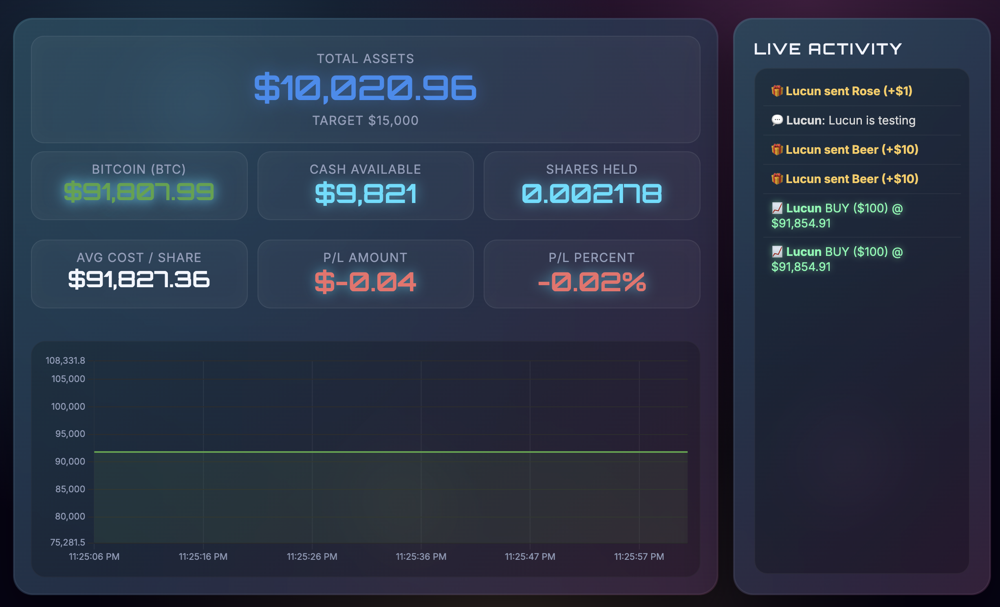
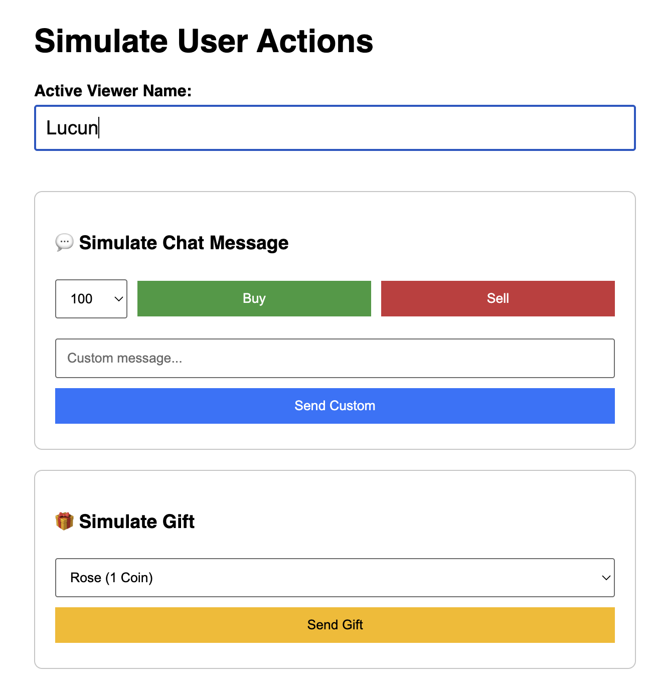

# Stock Stream Game

Interactive livestream trading game that combines real-time market data, chat-driven trades, and milestone-based celebrations. Designed for stream overlays or kiosk setups, the experience mirrors a modern trading dashboard while remaining mobile friendly for portrait-mode displays.



> _Tip:_ Replace the screenshot above with your latest capture (see the [Screenshots](#screenshots) section for details).

---

## Table of Contents
1. [Features](#features)
2. [Architecture](#architecture)
3. [Getting Started](#getting-started)
4. [Configuration](#configuration)
5. [Gameplay Flows](#gameplay-flows)
6. [Screenshots](#screenshots)
7. [Development Notes](#development-notes)
8. [Troubleshooting](#troubleshooting)

---

## Features
- **Live Market Feed**: Streams quotes from Yahoo Finance via `yahoo-finance2`, with smoothing on the chart axis to avoid jitter.
- **Chat-Driven Trading**: Viewers issue `buy` / `sell` commands (e.g., “buy 300”) through the `/api/message` endpoint; events animate in the HUD.
- **Gift-to-Cash Bridge**: `/api/gift` converts virtual gifts (coins) straight into in-game cash.
- **Milestone Celebrations**: Automatic confetti plus overlay banners for each $100 gain and configurable major targets.
- **Admin Simulator**: `public/admin.html` mimics viewers, letting you trigger trades/gifts without going live.
- **Mobile-First HUD**: Responsive layout optimized for 9:16 portrait screens; chart and stats refactor keeps everything above the fold.
- **Configurable Ticker**: `config.js` controls the symbol/name, so switching markets is a one-line change.

---

## Architecture

| Layer | Stack | Notes |
| --- | --- | --- |
| Web Server | Node.js + Express | Hosts static assets and JSON APIs (`/api/message`, `/api/gift`) |
| Realtime | Socket.IO | Broadcasts `state_update`, `trade_event`, `gift_event`, etc. |
| Market Data | `yahoo-finance2` | Pulls `regularMarketPrice` for `config.stockSymbol` every second |
| Frontend | Vanilla JS + Chart.js | `public/index.html` + `public/app.js` + `public/styles.css` |
| Admin Console | Plain JS form | `public/admin.html` posts commands to the server |

### State Flow
1. `server.js` maintains a `gameState` object (cash, shares, total assets, avg cost, P/L).
2. Every second, `gameLoop()` refreshes the quote, recalcs positions, and emits `state_update`.
3. Clients graph `history[]` in Chart.js; Y axis uses exponential smoothing to stay calm.
4. Commands (buy/sell/gift) mutate the server state and trigger toast-style event logs.

---

## Getting Started

```bash
git clone https://github.com/lucuncai/stock-stream-game.git
cd stock-stream-game
npm install
```

### Development Run
```bash
npm start
# or node server.js
```
Open http://localhost:3000 for the HUD, and http://localhost:3000/admin.html for the simulator.

> **Behind a proxy?** Set `HTTPS_PROXY` / `HTTP_PROXY` before starting so `yahoo-finance2` can reach the API (the server already hooks into `undici`’s `ProxyAgent` if those env vars exist).

---

## Configuration

`config.js`
```js
module.exports = {
    stockSymbol: 'TSLA',
    stockName: 'Tesla'
};
```

- `stockSymbol`: Yahoo Finance ticker (e.g. `BTC-USD`, `AAPL`, `GOOGL`).
- `stockName`: Human-readable label shown in the HUD.

Other tunables (e.g., starting cash, milestone thresholds) live near the top of `server.js`.

---

## Gameplay Flows

### 1. Viewer Trades via Chat
1. Client posts `{ user, text }` to `/api/message`.
2. Server parses commands (`buy 500`, `sell 200`, case-insensitive).
3. `handleBuy`/`handleSell` adjust `cash`, `shares`, `positionCost`.
4. Socket broadcast updates the chart, stats, and event log.

### 2. Gift Injection
1. Admin panel hits `/api/gift` with `{ user, giftValue, giftName }`.
2. Every coin adds equivalent cash; event log shows 🎁 entries.

### 3. Rewards & Milestones
- Every $100 gain triggers `milestone_event`.
- Crossing `rewardThreshold` fires `reward_trigger` and bumps the next target by $5,000.

---

## Screenshots

| HUD (Mobile Portrait) | Admin Simulator |
| --- | --- |
|  |  |

> Drop your actual PNG/JPG captures into `docs/screenshots/` with the names above (or update the paths). The sample thumbnails shown in the issues designer were taken from the TikTok-style overlay you see during testing.

To export new screenshots:
1. Run `npm start`.
2. Launch the HUD in Chrome, open DevTools → “Toggle Device Toolbar” (`Cmd+Shift+M`), choose a 9:16 preset, and capture.
3. Save as `docs/screenshots/mobile-dashboard.png` (and similar for the admin panel).

---

## Development Notes

- **Styling**: All CSS is in `public/styles.css`. The file is intentionally verbose with comments and gradient layers—feel free to split into partials if you bring in a bundler later.
- **Client Logic**: `public/app.js` manages Chart.js, socket listeners, and DOM updates. If you migrate to a framework (React/Vue/etc.), this file is a good blueprint for the shared state contract.
- **Admin Panel**: Keep `public/admin.html` lightweight so non-technical hosts can trigger demo events quickly.
- **Future Enhancements**:
  - Persist history (Redis or SQLite) for replays.
  - Plug in actual livestream chat API instead of the admin mock.
  - Add multi-asset support via additional `config` entries and tabbed charts.

---

## Troubleshooting

| Symptom | Fix |
| --- | --- |
| `ECONNRESET` / `ENOTFOUND` when fetching quotes | Ensure outbound internet or set proxy env vars before starting |
| HUD stuck at `$0.00` | Verify ticker symbol exists on Yahoo Finance; check server console for fetch errors |
| Chart or stats don’t update | Confirm Socket.IO connection (DevTools → Network → WS tab) |
| “Address already in use” | Stop previous `node server.js` instance or change the `PORT` in `server.js` |

---

## License
MIT © 2025 lucuncai

---

Enjoy the stream! Tag @lucuncai if you showcase the HUD live.

